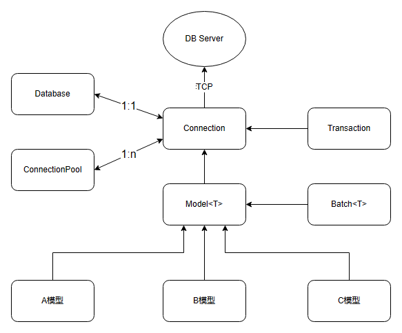

# MYSQL-ORM介绍

## 功能特性

1. 跨平台：支持 Linux、Windows 等
2. 支持增删改查 CRUD
3. 支持批量添加
4. 支持批量查询
5. 支持丰富的实用函数
6. 支持联表查询 join
7. 支持事务，嵌套事务
8. 支持数据库连接池
9. 防止 SQL 注入

# 结构图



### TODO

- [x] 日志logger部分，和数据库的Value对象
- [x] 批处理对象
- [x] 单个连接对象
- [x] 连接池、 数据库对象
- [x] 事务、模型
- [x] 示例

```angular2html
mkdir build
```
```angular2html
cd build
```
```angular2html
cmake ..
```
```
make
```
```angular2html
make install
```
